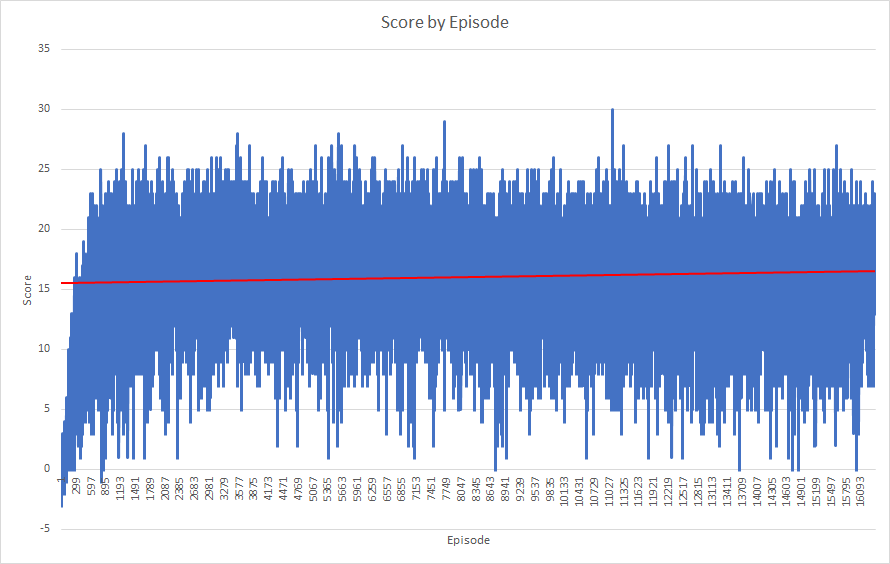
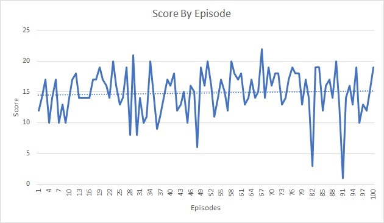

# Learning Algorithm

The learning algorithm used on this project is the Deep Q-Learn
algorithms described at the Human-level control through deep
reinforcement learning publication.

On the implemented algorithms the agent follows an ϵ-greedy policy
updated using the Bellman Expectation Equation and target network soft
update.

The hyper-parameters used on the training were

> ϵ-start: 1.0
>
> ϵ-end: 0.01
>
> ϵ-decay: 0.995
>
> γ: 0.999

The Optimization algorithm used was Adam with a 0.0005 learn rate.

The Deep Q-Learn algorithm used and experience replay buffer with 1
million samples, training on batches of 512 and soft update of target
network's parameters with τ equal to 0.001 every 16 episodes.

The Deep Neural Network model selected a forward 4 RELU layers full
connected network with 37 inputs from the Observation Space, 128 neurons
on the fist layer, 64 on the second, 32 on the third and 4 on the last
layer to match the Action Space size.

The Observation Space returned by the Unity environment contains the
agent's velocity, along with ray-based perception of objects around
agent's forward direction.

The environment returns 7 rays projecting from the agent at the
following angles and returned in this order 20, 90, 160, 45, 135, 70,
110 degrees where 90 is directly in front of the agent

Each ray is projected into the scene and if it encounters one of four
detectable objects, Banana, Wall, Bad_Banana and Agent; the value at
that position in the array is set to 1 and the last value is the
distance measure which is a fraction of the ray length.

[Banana, Wall, Bad_Banana, Agent, Distance]

For example [1, 0, 1, 0, 0.65] is a good banana detected at 65% of the
way along the ray and a wall behind it.

The other 2 values are the Agent's velocity left/right velocity and
forward/backward velocity.

Four discrete actions are available to control the agent and each one is
corresponded to one output neuron:

> 0 - move forward.
>
> 1 - move backward.
>
> 2 - turn left.
>
> 3 - turn right.

# Plot of Rewards

The model takes around 3222 episodes to complete the training, but the
implemented algorithms wait for 20000 more episodes to verify if is not
more improves occurs on the last 100 episodes average.

Using the trained model, 100 episodes were executed on play mode in
order to verify the model's performance.

On the previous plot is possible view tha agent have a average score
near to 15 over 100 episodes

# Ideas for Future Work

In addition to the idea of training the agent to use the raw pixels
image from the environment, that mean implement Convolutional Neural
Network to process the image, should be good try others activation
functions on the ray-based input space.
